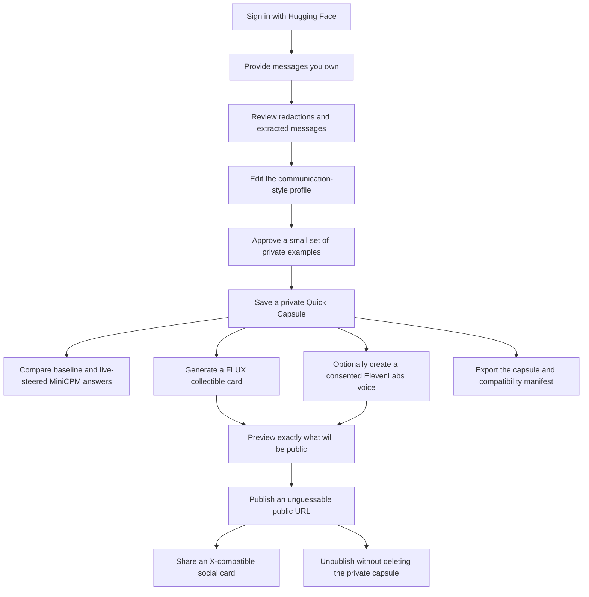
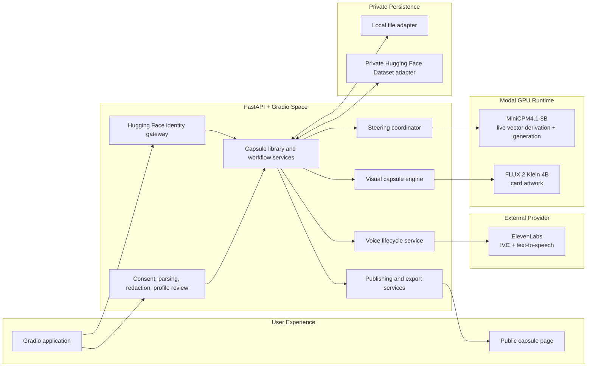
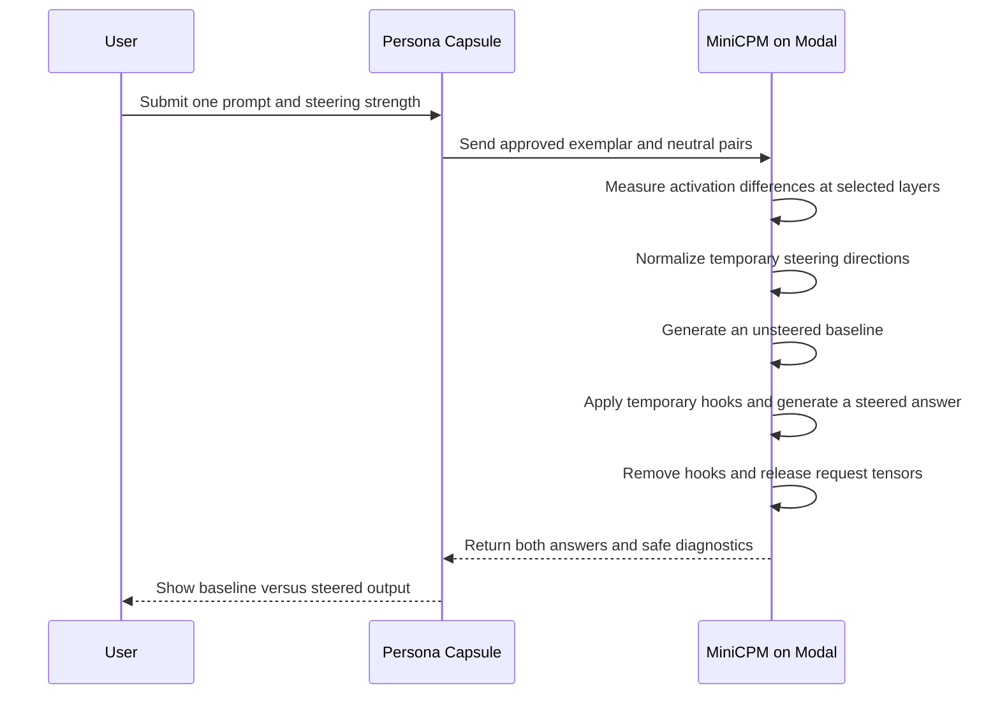

<!-- markdownlint-disable MD013 -->

# Persona Capsule

**Turn the way you communicate into a private, steerable, visual, and shareable
digital capsule.**

Persona Capsule is an AI experience built for the
[Hugging Face Build Small Hackathon 2026](https://huggingface.co/build-small-hackathon).
It learns the *shape* of a person's communication from examples they approve,
then lets them see, hear, export, and safely share that style.

It is not a psychological diagnosis and it does not claim to recreate a human
being. It is a user-controlled model of communication style.

[Product requirements](./PRD.md) ·
[Technical audit](./PLAN_AUDIT.md) ·
[Codex development record](./CODEX_USAGE.md) ·
[GitHub issues](https://github.com/perfect7613/persona-capsule/issues)

## The Idea, Simply

Most AI assistants can be told to "sound friendly" or "be concise." That is a
temporary instruction. Persona Capsule goes one step further:

1. You provide examples of messages you wrote.
2. The app removes obvious sensitive information.
3. You review what it understood and choose the examples it may retain.
4. MiniCPM compares your approved writing with neutral versions of the same
   ideas.
5. During each request, the model calculates a temporary steering direction
   toward your style.
6. You can compare the ordinary answer with the steered answer.
7. Your approved profile can become a collectible image, a synthetic voice
   sample, a portable export, or a public card.

Think of activation steering like adjusting a studio mixing desk. The underlying
song stays the same, but selected characteristics become quieter or stronger.
Persona Capsule calculates those adjustments from your approved examples and
removes them when the request ends.

## What A Capsule Contains

A capsule is a controlled package of references and metadata, not a copy of a
person.

| Part | Purpose |
| --- | --- |
| Approved style profile | Human-readable description and editable style controls |
| Private exemplar pairs | Selected writing examples and neutral contrasts |
| Steering recipe | Exact MiniCPM model, revision, layers, and calculation settings |
| Card assets | Interactive and 1200×628 social images |
| Optional voice reference | Private ElevenLabs voice ID and synthetic samples |
| Public projection | Only the fields explicitly selected for sharing |
| Export manifest | Compatibility information and integrity hashes |

The capsule deliberately does **not** store a permanent user activation tensor.
Steering directions are derived during inference and remain request-scoped.

## User Journey



## Privacy From First Principles

Personal writing and voice require a stricter design than an ordinary image
generator. Persona Capsule follows these rules:

1. **Private by default.** Creating a capsule never publishes it.
2. **Ownership before processing.** Text and voice require an explicit rights
   or permission confirmation.
3. **Review before retention.** The user chooses which small set of writing
   examples is kept.
4. **Store recipes, not activation tensors.** User steering tensors are
   temporary runtime data.
5. **Delete source audio.** Uploaded voice recordings are removed locally after
   the ElevenLabs cloning request.
6. **Separate private and public records.** Share pages are rendered from a
   selected public projection, not the canonical private capsule.
7. **Make external cleanup retryable.** If provider deletion is unavailable,
   the capsule records a pending cleanup instead of pretending deletion worked.
8. **Keep secrets outside Git.** API credentials belong in local `.env`, Hugging
   Face Space Secrets, or Modal Secrets.

## System Architecture



## How Live Steering Works



This makes the core claim inspectable: the application shows the same prompt
with and without steering rather than asking the user to trust an invisible
personalization process.

## Implemented Features

| Capability | Status | Implementation |
| --- | --- | --- |
| FastAPI + Gradio application | Complete | Health route, provider status, custom interface |
| Hugging Face identity | Complete | OAuth-ready creator operations and owner-scoped records |
| Text ingestion and redaction | Complete | Consent, parsing, quality checks, editable profile |
| Inference-time MiniCPM steering | Complete | Live derivation, baseline comparison, cleanup diagnostics |
| Private capsule lifecycle | Complete | Save, reopen, rename, export, and idempotent deletion |
| FLUX card generation | Complete | Modal provider, controlled seeds, deterministic fallback |
| Public sharing | Complete | Field preview, stable slug, Open Graph/X metadata, unpublish |
| ElevenLabs voice lifecycle | Implemented | Real IVC, speech, retention, deletion, cleanup retries |
| Capsule fusion | Planned | Compatible weighted steering and provenance |
| Nemotron battle | Planned | Blinded A/B and B/A judging on Modal |
| Deep Capsule LoRA jobs | Planned | Asynchronous evaluated training |
| Hackathon Space deployment | In progress | Targeting the official `build-small-hackathon` organization |

## Technology

- **MiniCPM4.1-8B** is the primary language model and activation-steering target.
- **Modal** hosts GPU-intensive MiniCPM and FLUX workloads.
- **FLUX.2 Klein 4B** produces profile-derived card artwork.
- **ElevenLabs** provides consented Instant Voice Cloning and text-to-speech.
- **Hugging Face OAuth** binds private capsules to their creators.
- **Hugging Face Dataset storage** provides the deployment persistence boundary.
- **FastAPI** serves health, creator, image, audio, and public metadata routes.
- **Gradio** provides the authenticated interactive application.
- **OpenAI Codex** contributes architecture, implementation, testing,
  documentation, and deployment work with commit attribution.

## Repository Guide

```text
app.py                         Hugging Face Space entry point
modal_minicpm.py               Modal MiniCPM steering runtime
modal_flux.py                  Modal FLUX image runtime
src/persona_capsule/
  app.py                       FastAPI composition root and public routes
  ingestion.py                 Consent, parsing, redaction, and profile draft
  steering.py                  Model compatibility and steering recipe
  steering_service.py          Owner-safe steering workflow
  card.py                      Prompt mapping and card composition
  voice.py                     Real ElevenLabs voice lifecycle
  repository.py                Canonical schema and storage adapters
  publishing.py                Public projection and social metadata
  export.py                    .persona and compatibility exports
  ui.py                        Gradio experience
tests/                         Unit and provider-contract tests
PRD.md                         Approved product requirements
PLAN_AUDIT.md                  Original-plan technical audit
CODEX_USAGE.md                 Public Codex development record
```

## Run Locally

### Requirements

- Python 3.11 or newer
- [`uv`](https://docs.astral.sh/uv/)
- Provider credentials only for the live features you want to exercise

### Install

```bash
git clone https://github.com/perfect7613/persona-capsule.git
cd persona-capsule
uv sync --extra dev
cp .env.example .env
```

The app can start without provider credentials. Unconfigured optional features
are reported as unavailable while private capsule access remains functional.

For local interface development, enable the explicit non-production identity:

```dotenv
APP_ENV=development
PERSONA_LOCAL_IDENTITY=true
PERSONA_LOCAL_HF_USERNAME=your-hugging-face-username
```

Then run:

```bash
uv run persona-capsule
```

Open:

- Application: `http://127.0.0.1:7860/app/`
- Health check: `http://127.0.0.1:7860/healthz`

The local identity adapter works only in `development` and `test`. It is not an
anonymous production login.

## Configuration

| Variable | Purpose |
| --- | --- |
| `APP_ENV` | `development`, `test`, or production environment label |
| `HF_TOKEN` | Hugging Face API access and local OAuth availability |
| `HF_CAPSULE_REPO_ID` | Private Dataset repository used for durable capsules |
| `MODAL_TOKEN_ID` | Modal authentication ID |
| `MODAL_TOKEN_SECRET` | Modal authentication secret |
| `ELEVENLABS_API_KEY` | Real Instant Voice Cloning and text-to-speech |
| `VOICE_TEMPORARY_HOURS` | Lifetime of temporary voice clones; default `24` |
| `FLUX_LORA_REPO_ID` | Optional global FLUX LoRA repository |
| `PERSONA_CAPSULE_DATA_DIR` | Local records, artifacts, and export directory |
| `PUBLIC_BASE_URL` | Canonical base URL used in public share metadata |
| `PERSONA_LOCAL_IDENTITY` | Enables the development-only identity adapter |
| `PERSONA_LOCAL_HF_USERNAME` | Username used by that local adapter |

Never commit `.env`. Credentials previously exposed in chat, logs, screenshots,
or issues must be rotated before deployment.

## Deploy Modal Runtimes

Authenticate with rotated Modal credentials, then deploy the independent GPU
services:

```bash
uv run modal deploy modal_minicpm.py
uv run modal deploy modal_flux.py
```

Keeping the language and image runtimes separate prevents both large models
from occupying GPU memory at the same time.

## Quality Checks

```bash
uv run ruff format --check .
uv run ruff check .
uv run pytest
uv lock --check
```

GitHub Actions runs the same format, lint, and test checks on pushes and pull
requests.

## Failure Behavior

Persona Capsule is designed so optional providers fail independently:

- MiniCPM failure does not delete or corrupt a capsule.
- FLUX failure produces a deterministic local card.
- ElevenLabs failure leaves text, steering, and card features available.
- Failed voice deletion becomes a visible retryable cleanup state.
- Publishing and unpublishing do not modify the private source profile.
- Quick Capsules remain usable even if future Deep Capsule training fails.

## Hackathon Positioning

Persona Capsule is built around a complete, visible product loop rather than a
collection of disconnected model calls:

**approve your signal → steer a model → create an object → optionally give it a
voice → share only what you choose**

The project demonstrates meaningful use of:

- **OpenBMB / MiniCPM** for the central inference-time steering experience;
- **Modal** for GPU model execution;
- **Black Forest Labs FLUX** for collectible visual identity;
- **ElevenLabs** for consented synthetic voice;
- **NVIDIA Nemotron** in the planned blinded battle evaluator;
- **OpenAI Codex** as an attributed engineering collaborator.

## Built With Codex

OpenAI Codex has been used to audit the original plan, verify current provider
documentation, design the architecture, create the PRD and implementation
issues, write code and tests, inspect visual output, and support deployment.

Codex-authored commits carry:

```text
Co-authored-by: Codex <noreply@openai.com>
```

See [CODEX_USAGE.md](./CODEX_USAGE.md), [AGENTS.md](./AGENTS.md), and the
[commit history](https://github.com/perfect7613/persona-capsule/commits/main/)
for public evidence.

## Important Limitations

- A communication-style capsule is not a clinical or psychological assessment.
- Steering behavior is tied to the exact MiniCPM model and recipe.
- Voice cloning requires the speaker's ownership or explicit permission.
- Public sharing exposes only selected fields, but users must still review the
  preview carefully.
- Model outputs and future battle scores are generated feedback, not objective
  judgments about a person.

## Project Links

- [Approved PRD](./PRD.md)
- [Canonical PRD discussion](https://github.com/perfect7613/persona-capsule/issues/1)
- [Implementation issues](https://github.com/perfect7613/persona-capsule/issues)
- [Technical plan audit](./PLAN_AUDIT.md)
- [Image fine-tuning branch audit](./docs/IMAGE_FINETUNE_BRANCH_AUDIT.md)
- [Codex usage record](./CODEX_USAGE.md)
